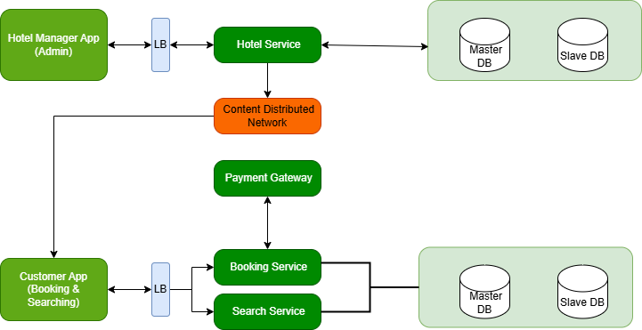

 # Requirement Analysis in Software Development

## 📌 Introduction
This repository documents the **Requirement Analysis Project**, focusing on defining, analyzing, and structuring requirements for a **Booking Management System**. Requirement Analysis is a crucial phase in the Software Development Lifecycle (SDLC), ensuring that the system is built with clarity, precision, and alignment to user and business needs.

---

## What is Requirement Analysis? 📖 
Requirement Analysis is the process of identifying, documenting, and managing the needs and expectations of stakeholders for a software system.  
It ensures that both **functional** and **non-functional** requirements are well-understood before development begins.  

Key goals include:
- Clarifying business needs
- Preventing scope creep
- Providing a foundation for design, development, and testing

---

##  Why is Requirement Analysis Important? 💡
Requirement Analysis plays a critical role in the SDLC for several reasons:
1. **Clarity & Alignment** – Ensures all stakeholders have a shared understanding of the system’s goals.  
2. **Risk Mitigation** – Identifies potential challenges early, reducing costly changes later.  
3. **Efficiency & Quality** – Guides developers and testers, ensuring the final product meets expectations.  

---

##  Key Activities in Requirement Analysis ⚙️
Requirement Analysis typically involves five main activities:

- **Requirement Gathering** – Collecting information from stakeholders through interviews, surveys, or observation.  
- **Requirement Elicitation** – Engaging stakeholders to uncover hidden needs and priorities.  
- **Requirement Documentation** – Structuring gathered information into clear, accessible documents.  
- **Requirement Analysis and Modeling** – Using diagrams and models to refine and visualize requirements.  
- **Requirement Validation** – Reviewing requirements with stakeholders to confirm accuracy and completeness.  

---

## Types of Requirements 📝 

### 🔹 Functional Requirements
Functional requirements define what the system **should do**.  
Examples for a booking management system:
- Users should be able to **create and manage bookings**.  
- The system should send **confirmation emails** after successful booking.  
- Admins should be able to **view, update, or cancel bookings**.  

### 🔹 Non-Functional Requirements
Non-functional requirements describe **how the system should behave**.  
Examples:
- The system should handle **up to 10,000 concurrent users**.  
- Response time for booking confirmation should be **less than 2 seconds**.  
- The application should support **multiple devices (desktop, mobile, tablet)**.  

---

## Use Case Diagrams 🎭 
Use Case Diagrams visually represent system interactions between **actors** and **use cases**.  
They help stakeholders understand the system scope at a glance.  

Example Use Case Diagram for the Booking Management System:  

Actors may include:  
- **Customer** – Make a booking, view bookings, cancel booking.  
- **Admin** – Manage bookings, generate reports.  
- **Payment Gateway** – Process payments.  

---

##  Acceptance Criteria ✅
Acceptance Criteria are measurable conditions that a system must meet to be accepted by the user or client.  

### Example (Checkout Feature in Booking Management System):  
- Users can select a booking and proceed to checkout.  
- The system must calculate the total amount, including taxes and discounts.  
- Payment must be successfully processed through the payment gateway.  
- A confirmation email must be sent within **1 minute** of successful payment.  

---
 
---

## 📌 Key Highlights
- Real-world scenario: Booking Management System  
- Clear documentation of functional and non-functional requirements  
- Use Case diagram for visualization  
- Example acceptance criteria for features  

---

## ✨ Conclusion
This project provides hands-on experience with **Requirement Analysis**, the foundation of successful software development. By documenting requirements, creating diagrams, and defining acceptance criteria, developers ensure that systems are **scalable, user-friendly, and aligned with business goals**.  

---

